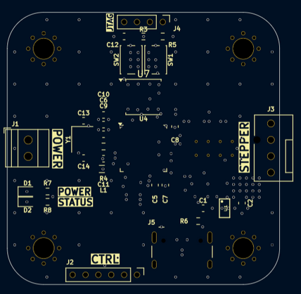

# Stepper_Driver
A feedback stepper driver

# Setup
* Clone the repo
* Follow the steps at https://github.com/MarijnVerschuren/STM32F412
* Add a connector to J4 (JTAG) to program it using a STLink V2/3
 
 * Run the configuration on CLion