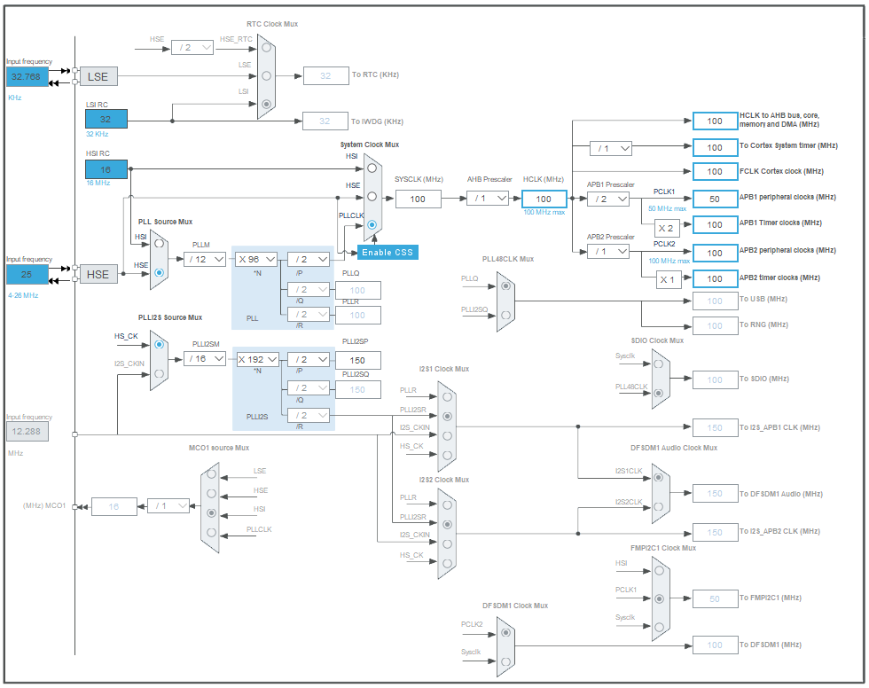

># stepper_driver design
> This document will describe the design criteria and considerations
> 1. Critera
> 2. Component selection
>    1. Stepper driver
>    2. Sensor
>    3. Flash module
>    4. Micro controller
> 3. Physical design
> 4. Software design
>    1. Sys init
>    2. GPIO config
>    3. EXTI config
>    4. ADC config
>    5. TIM config
>    6. UART config
>    7. I2C config
>    8. AS5600 config
>    9. main loop

>## 1. Criteria
> The goal this system is trying to achieve is feedback control for a NEMA17 stepper motor
> the requirements are as follows:
>
>| Name                |                                                                                                   Description |
>|:--------------------|--------------------------------------------------------------------------------------------------------------:|
>| Stepper control     |                                               The stepper motor should be<br>controlled / moved by the system |
>| Stepper sensing     |                                    The position of the stepper motor<br>should be able to be read by a sensor |
>| Feedback control    | The micro controller should run a PID<br>controller to use the sensor data to<br>correct the stepper position |
>| Settings flash unit |                    The system should have a flash module<br>to store configurations for the PID<br>controller | 
>| Control input bus   |                          The micro controller should listen on a<br>SPI bus for commands from a master device |
 
>## 2. component selection
>### i. Stepper driver
> for the stepper driver I chose the TMC2226 due to the large amount of features and easy to solder package (HTSSOP28)
> the features include:
> 
> | Feature                |                                                                                                      Description |
> |:-----------------------|-----------------------------------------------------------------------------------------------------------------:|
> | High power             |                                                                       High power output capabilities (2.8A, 29V) |
> | High surface area      |                      High surface area to effectively dissipate<br>the heat generated from the high output power |
> | Precise micro stepping |                           Up to 1/64 micro step setting allowing a precision<br>of 360/(200 * 64) = 0.028125 deg |
> | Stall guard 4          |          A built in system from TRINAMIC that prevents<br>stalling and notifies the microcontroller on occurance |
> | UART connectivity      |                                                                    UART connectivity for precise setting control |
> | Builtin 5V regulator   | This feature converts the motor source voltage to<br>a stable 5V supply from which the rest of the system is run |
>### ii. Sensor
> for the Sensor I chose the AS5600 because of the ease of use and availability. additionally my microcontroller only allows up to 12-bit analog signal precision.
> the features include:
> 
> | Feature                   |                                                                                                                               Description | 
> |:--------------------------|------------------------------------------------------------------------------------------------------------------------------------------:|
> | HAL effect rotary encoding |                                              The sensor uses a magnet to find the rotation<br>of the motor allowing contactless operation |
> | I2C communication         |                                          The sensor is initialized and can be read<br>using I2C which is quite fast and easy to implement |
> | Analog output             | The sensor can output its reading as an analog<br>signal allowing the microcontroller to quicly read<br>it without using I2C with the ADC |
>### iii. Flash module
> for the Flash module I chose the W25Q128JVS due to its large capacity and speed.
> the features include:
> 
> | Feature           |                                                                                                Description |
> |:------------------|-----------------------------------------------------------------------------------------------------------:|
> | Large capacity    |                     The W25Q128JVS has a capacity of 16MB which<br>is more than enough for any application |
> | SPI communication | The module communicates with SPI which<br>is even faster than I2C allowing the config to<br>be quicly read |
>### iv. Micro controller
> I chose the STM32F412CGU6 as the microcontroller due to its small package and refined USB capabilities.
> Most development of this project was done on a STM32F411 which is very similar to the 412 but has an USB hardware error.
> To allow possible setting updates via USB I chose the STM32F412CGU6. Features include:
> 
> | Feature |        Description        |                                                          Use |
> |:--------|:-------------------------:|-------------------------------------------------------------:|
> | I2C     |   I2C device up to 1MHz   |                                     init phase of the AS5600 |
> | ADC     |        12-bit ADC         |                                    continuous AS5600 readout |
> | 2x SPI  |   multiple SPI devices    | 1. Flash module init and use<br>2. Control input from master |
> | TIM     |       32-bit Timer        |             Used to time the start of<br> the ADC conversion |
> | USB     |   Improved USB hardware   |                                           Settings interface | 
> | Fast    | system clock up to 100MHz |                              Quick response and calculations |
> | Small   |    Small QFN48 package    |                             Easy to solder and small package |

>## 3. Physical design
> Physical design documents:
> 
> | File          |                       Description |
> |:--------------|----------------------------------:|
> | schematic.pdf |   PDF for the PCB circuit diagram |
> | layout.pdf    | PDF for the PCB layout and layers |

>## 4. Software design
>### i. sys init
> ```C
> 1:  set_SYS_hardware_config(PWR_LVL_NOM, 25000000);                                             // 3v3, HSE@25MHz
> 2:  set_SYS_oscilator_config(0, 1, 0, 0, 1, 0, 0, 0, 0);                                        // enable HSE, CSS and the backup-domain
> 3:  set_SYS_PLL_config(PLL_CLK_SRC_HSE, 12U, 96U, PLL_P_DIV_4, 0, 0);                           // enable PLL @ 25MHz / 12 * 96 / 2 -> 100MHz
> 4:  set_SYS_clock_config(SYS_CLK_SRC_PLL_P, AHB_CLK_NO_DIV, APBx_CLK_DIV2, APBx_CLK_NO_DIV);    // configure sys / peripheral clocks
> 5:  set_SYS_tick_config(1);                                                                     // enable SYS_tick with interrupt
> 6:  sys_init();                                                                                 // write settings
> ```
> 1. This code starts off declaring the physical configuration: Power level and HSE(High Speed External oscillator) clock-speed.
> 2. It moves on by enabling certain internal clock systems seen in the clock diagram<br>.
> 3. Then the PLL's are configured (also seen in the clock diagram).
> 4. Then it sets the sys clock source and configures the peripheral clocks
> 5. Finally, the sys-tick mechanism is configured and enabled
> 6. The configuration is written at once so that correct order of operations is ensured
> To see the code behind the functions see: https://github.com/MarijnVerschuren/STM32F412/blob/main/src/sys.c
>
>### ii. GPIO config
> ```C
> 1:  config_GPIO(TMC_MS1_PORT, TMC_MS1_PIN, GPIO_output | GPIO_no_pull | GPIO_push_pull);          // TMC_MS1
> 2:  config_GPIO(TMC_MS2_PORT, TMC_MS2_PIN, GPIO_output | GPIO_no_pull | GPIO_push_pull);          // TMC_MS2
> 3:  config_GPIO(TMC_NEN_PORT, TMC_NEN_PIN, GPIO_output | GPIO_no_pull | GPIO_push_pull);          // TMC_NEN
> 4:  config_GPIO(STATUS_LED_PORT, STATUS_LED_PIN, GPIO_output | GPIO_no_pull | GPIO_push_pull);    // status LED
> 5:  config_GPIO(FLASH_NWP_PORT, FLASH_NWP_PIN, GPIO_output | GPIO_no_pull | GPIO_push_pull);      // FLASH_NWP
> 6:  config_GPIO(FLASH_NRST_PORT, FLASH_NRST_PIN, GPIO_output | GPIO_no_pull | GPIO_push_pull);    // FLASH_NRST
> 7:  config_GPIO(TMC_STEP_PORT, TMC_STEP_PIN, GPIO_output | GPIO_no_pull | GPIO_push_pull);        // TMC_STEP
> 8:  config_GPIO(TMC_DIR_PORT, TMC_DIR_PIN, GPIO_output | GPIO_no_pull | GPIO_push_pull);          // TMC_DIR
> 9:  config_GPIO(TMC_SPREAD_PORT, TMC_SPREAD_PIN, GPIO_output | GPIO_no_pull | GPIO_push_pull);    // TMC_SPREAD
> 10: config_GPIO(TMC_STDBY_PORT, TMC_STDBY_PIN, GPIO_output | GPIO_no_pull | GPIO_push_pull);      // TMC_STDBY
> 11: GPIO_write(TMC_NEN_PORT, TMC_NEN_PIN, 1);                                                     // disable TMC chip
> 12: GPIO_write(TMC_MS1_PORT, TMC_MS1_PIN, 0);                                                     // set MS1 setting for 1/8
> 13: GPIO_write(TMC_MS2_PORT, TMC_MS2_PIN, 0);                                                     // set MS2 setting for 1/8
> 14: GPIO_write(STATUS_LED_PORT, STATUS_LED_PIN, 1);                                               // status LED off
> ```
> GPIO pins used for the driver control, status led and flash module are configured and set to their default state
> To see the code behind the functions see: https://github.com/MarijnVerschuren/STM32F412/blob/main/src/GPIO.S
> 
>### iii. EXTI config
> ```C
> 1:  config_EXTI_GPIO(TMC_DIAG_PORT, TMC_DIAG_PIN, 1, 0);          // TMC_DIAG
> 2:  NVIC_set_IRQ_priority(EXTI0_IRQn, 0);                         // TMC_DIAG-IRQ
> 3:  config_EXTI_GPIO(TMC_INDEX_PORT, TMC_INDEX_PIN, 1, 0);        // TMC_INDEX
> 4:  NVIC_set_IRQ_priority(EXTI1_IRQn, 2);                         // TMC_INDEX-IRQ
> 5:  start_EXTI(TMC_DIAG_PIN); start_EXTI(TMC_INDEX_PIN);          // start TMC interrupts
> ```
> 1. the EXTI (EXTernal Interrupt) is enabled on the TMC_DIAG pin, this pin goes high if stall or other error is detected
> 2. the interrupt priority for the DIAG interrupt is set
> 3. the EXTI is enabled on the TMC_INDEX pin, this pin goes high every full step
> 4. the interrupt priority for the INDEX interrupt is set
> 5. both interrupts are started
> To see the code behind the functions see: https://github.com/MarijnVerschuren/STM32F412/blob/main/src/EXTI.S
> 
> DIAG interrupt:
> ```C
> 1:  void EXTI0_handler(void) {
> 2:    EXTI->PR = 0x00000001UL;
> 3:    return;
> 4:  }
> ```
> TODO
> 
> INDEX interrupt
> ```C
> 1:  void EXTI1_handler(void) {
> 2:    EXTI->PR = 0x00000002UL;
> 3:    return;
> 4:  }
> ```
> TODO
>
>### iv. ADC config
> ```C
> 1:  config_ADC(ADC_CLK_DIV2 | ADC_INJ_DISC | ADC_RES_12B | ADC_EOC_SINGLE | ADC_INJ_TRIG_TIM1_TRGO | ADC_INJ_TRIG_MODE_RISING);
> 2:  config_ADC_watchdog(AS5600_OUT_PIN, ADC_WDG_TYPE_INJECTED, 200, 3900);
> 3:  config_ADC_IRQ(1, ADC_IRQ_JEOC | ADC_IRQ_WDG);
> 4:  config_ADC_GPIO_inj_channel(AS5600_OUT_PORT, AS5600_OUT_PIN, ADC_SAMPLE_28_CYCLES, 409, 0);   // AS5600 out
> ```
> 1. the ADC is enabled to work in injected mode with a resolution of 12-bit and be triggered by the TIM1_TRGO event
> 2. the ADC watchdog is configured to raise an error if the signal ventures outside the `0.05*VCC - 0.95*VCC` window
> 3. the JEOC (inJecte End Of Conversion) and WDG interrupts are enabled with a priority of 1
> 4. the channel for the AS5600 out pin is configured with an offset of `0.1*VCC` (which will automatically be subtracted in hardware)
> To see the code behind the functions see: https://github.com/MarijnVerschuren/STM32F412/blob/main/src/ADC.c
>
> ADC interrupt:
> ```C
> 1:  uint8_t status = ADC1->SR;
> 2:  ADC1->SR = ~status;
> 3:  if (status & 0b000001) {
> 4:    return;  // watchdog
> 5:  }
> 6:  if (status & 0b000100) {
> 7:    uint32_t a = ADC1->JDR1;
> 8:    angle = a + (a / 4);
> 9:    return;
> 10: }
> ```
> TODO
> 
>### v. TIM config
> ```C
> 1:  config_TIM_master(TIM1, 10000, 100, TIM_TRGO_UPDATE);         // 100 Hz
> 2:  start_TIM_update_irq(TIM1);
> ```
> 1. the timer is configured to run at 10KHz and generate a TRGO event at 100Hz
> 2. start the timer update interrupt (for status led)
> To see the code behind the functions see: https://github.com/MarijnVerschuren/STM32F412/blob/main/src/tim.c
> 
> TIM interrupt:
> ```C
> 1:  void TIM1_update_handler(void) {
> 2:    TIM1->SR &= ~0x00000001UL;
> 3:    GPIO_toggle(STATUS_LED_PORT, STATUS_LED_PIN);
> 4:    return;
> 5:  }
> ```
> TODO
>
>### vi. UART config
> ```C
> config_UART(TMC_UART_TX_DEV_PIN, TMC_UART_RX_DEV_PIN, 115200);    // TMC_UART
> ```
> Configures the UART for the TMC driver at 115200 bits/s
> To see the code behind the functions see: https://github.com/MarijnVerschuren/STM32F412/blob/main/src/USART.S
> and:                                      https://github.com/MarijnVerschuren/STM32F412/blob/main/src/USART.c
>
>### vii. I2C config
> ```C
> config_I2C(AS5600_I2C_SCL_DEV_PIN, AS5600_I2C_SDA_DEV_PIN, 0x00); // AS5600_I2C
> ```
> Configures the I2C for the AS5600 at the default rate of 100KHz
> To see the code behind the functions see: https://github.com/MarijnVerschuren/STM32F412/blob/main/src/I2C.c
> 
>### viii. AS5600 config
> ```C
> 1:  while (config_AS5600(
> 2:    I2C2, AS5600_POW_NOM | AS5600_HYST_2LSB | AS5600_MODE_REDUCED_ANALOG |
> 3:    AS5600_SFILTER_2 | AS5600_FFILTER_10LSB | AS5600_WDG_ON, 10
> 4:  )) { delay_ms(10); }
> ```
> Configures the AS5600 to work at 3v3 with fast filter mode, reduced analog signal `0.1*VCC - 0.9*VCC` and watchdog until successful
> To see the code behind the functions see: https://github.com/MarijnVerschuren/STM32F412/blob/main/lib/AS5600/AS5600.c
>
>### ix. main loop
> ```C
> 1:  start_ADC(0, 1);                          // start ADC injected channels
> 2:  start_TIM(TIM1);                          // start ADC polling timer
> 3:  GPIO_write(TMC_NEN_PORT, TMC_NEN_PIN, 0); // enable TMC chip
>
> 4:  while (1) {
> 5:    GPIO_toggle(TMC_STEP_PORT, TMC_STEP_PIN);
> 6:    delay_ms(1);
> 7:  }
> ```
> 1. starts the injected ADC channels
> 2. start the ADC trigger timer
> 3. enable the TMC driver
> 
> TODO
>
